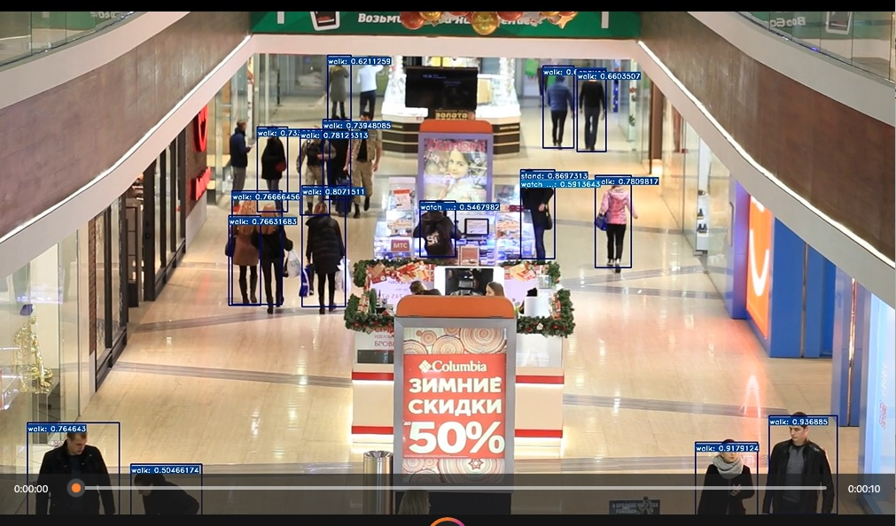
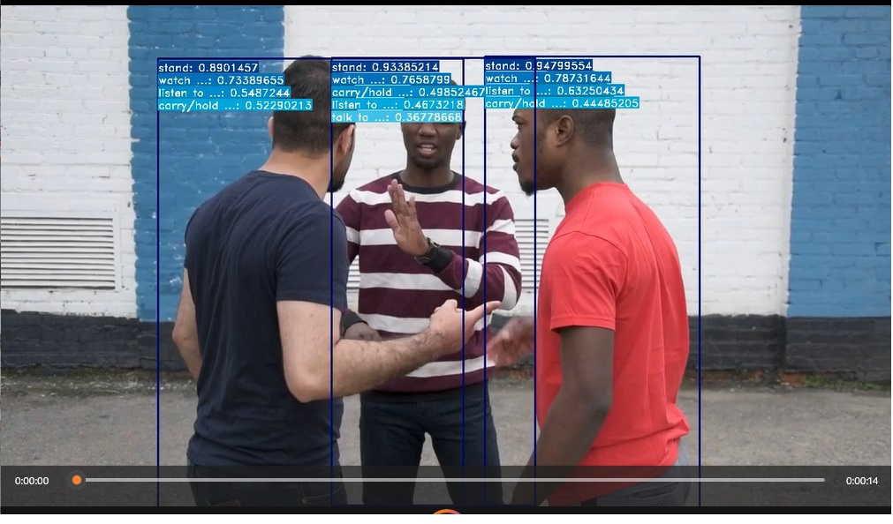

# 1. Introduction
Implementation of a video-based Action Recognition algorithm. The model that has been implemented is the SlowFast network, with YOLOv3 as the first stage human detector. Model has been implemented using the MMAction2 repository. 

As the implementation is expected to run in real-time, FPS is an important consideration and I will actively take steps to improve FPS at the expense of mAP, as will be explained in section 3, Choice of Model Implemented.

# 2. MMAction2
[MMAction2](https://github.com/open-mmlab/mmaction2/blob/master/README.md) is an open-source toolbox for video understanding based on PyTorch. It is a part of the OpenMMLab project.

# Choice of Framework Implemented
MMAction2 has been chosen for the following reasons:
1. [Performs better in terms of training time](https://github.com/open-mmlab/mmaction2/blob/master/docs/benchmark.md)
    - Training performance has been compared to other popular frameworks, such as:
        - MMAction
        - Temporal-Shift-Module
        - PySlowFast
        - BSN(boundary sensitive network)
        - BMN(boundary matching network)
    - MMAction2 has been found to have a faster training speed across all models tested. 
    - Crucially, the SlowFast model, which is the model we have implemented, is one of the models tested. This indicates that when the model is eventually finetuned for more specific usecases, we will be able to incur lower training costs.  

2. Easily configurable
    - MMAction2 has been designed to be modular, where users can easily swap out modules to fulfil their respective use cases. 
    - Supports different methods for action recognition, including TSN and SlowFast.
    - Even within the SlowFast implementation, there are also options to decide between different backbones (e.g. ResNet-50 vs ResNet-101) and different training data (e.g. AVA2.1 vs AVA2.2)

3. Appropriate license
    - Licensed under the Apache License 2.0, which allows for commercial and private use. This is unlike other more restrictive license types which may disallow the use of the repository for profit. 

# 3. Choice of Model Implemented
I have chosen the [SlowFast](https://openaccess.thecvf.com/content_ICCV_2019/html/Feichtenhofer_SlowFast_Networks_for_Video_Recognition_ICCV_2019_paper.html) framework for this action recognition tast. 

## *insert some stuff to describe how it works*

As the model had been trained on AVA v2.2, which focuses on spatiotemporal localisation of human actions. The dataset contains 430 videos split into 235 for training, 64 for validation, and 131 for test. Each video has 15 minutes annotated in 1 second intervals and these videos are sourced from movies. 

There are 80 classes in the dataset (although model evaluation is usually done on a subset of 60 classes instead). Some of the actions include common actions such as walking and standing and other actions that could raise security concerns such as fighting and pushing another person. The latter would be especially pertinent to the use case of video surviellance at malls. 

The first stage human detector framework is implemented using [YOLOv3](https://arxiv.org/abs/1804.02767) with a MobileNetV2 backbone. 
- YOLOv3 vs [Faster R-CNN](https://arxiv.org/abs/1506.01497)
    - YOLOV3 has a much higher inference FPS relative to Faster-RCNN, although the former's mAP tend to also be poorer than the latter's. This is because YOLOV3 is a single shot detector, while Faster R-CNN is a two stage region based object detector.
    - The inputs into Faster R-CNN first go through a region proposal network (RPN) first to generate the Regions of Interest (ROIs), before the ROIs are fed into the fully connected layers to classify the object and to have the bounding boxes refined.
    - Conversely, YOLOv3 only uses a single convolutional network to simultaneously predict the bounding boxes and class probabilities of the boxes. 
    - Hence, for our use case, where FPS is deemed to be important, I have prioritised inference speed ahead of mAP, and have chosen the YOLOv3 framework as the human detector framework. 
- YOLOv3 [MobileNetV2](https://arxiv.org/abs/1704.04861) vs YOLOv3 DarkNet-53
    - The choice of backbone in object detection models are also important. Due to the small and lightweight nature of Mobilenet, when tested on the SSD 300 and Faster R-CNN, it has been found to achieve comparable mAP at a fraction of the computational complexity and model size. 
    - Hence, the inference speed of YOLOv3 can be further sped up with the swapping of the backbone to MobileNetV2. This observation has also been **emphirically tested for my particular implementation- the FPS was better for the mobilenet backbone relative to the darknet backbone.** 


# 4. Setting up of the environment 
```
git clone https://github.com/yuxuanneo/action-recognition.git
conda create -n open-mmlab python=3.8 
conda activate open-mmlab
conda install -c pytorch pytorch torchvision -y

pip install -U openmim
mim install mmcv-full
pip install webcolors
pip install moviepy

# install mmaction2
cd src/mmaction2
pip install -r requirements/build.txt
pip install -v -e . 

# install mmdetection
pip install mmdet
```

# 5. Results
The model has also been conveniently implemented with a [config file](configs/mmaction.yaml). In the config file, user can swap out different model frameworks and human detectors to experiment with one that works best for the use case. 

| Key | Values used | Description
| ------------- | ------------- | ------------- |
| video  | 'inputs/people_fighting.mp4'  | Video to be fed into the model |
| config  | 'configs/detection/ava/slowfast_kinetics_pretrained_r50_8x8x1_cosine_10e_ava22_rgb.py'  | The action detection config file path |
| checkpoint  | 'https://download.openmmlab.com/mmaction/detection/ava/ slowfast_kinetics_pretrained_r50_8x8x1_cosine_10e_ava22_rgb/ slowfast_kinetics_pretrained_r50_8x8x1_cosine_10e_ava22_rgb-b987b516.pth'  | The action detection checkpoint URL |
| det-config  | 'configs/human_detection/yolov3_mobilenetv2_mstrain-416_300e_coco.py'  | The human detection config file path|
| det-checkpoint  | 'https://download.openmmlab.com/mmdetection/v2.0/yolo/yolov3_mobilenetv2_mstrain-416_300e_coco/yolov3_mobilenetv2_mstrain-416_300e_coco_20210718_010823-f68a07b3.pth'  | The human detection checkpoint URL |
| det-score-thr  | 0.3  | The score threshold for human detection |
| action-score-thr  | 0.3  | The score threshold for action detection |
| label-map  | 'tools/data/ava/label_map.txt'  | The label map used |
| predict-stepsize  | 8  | Make a prediction per N frames |
| output-stepsize  | 4  |  Output 1 frame per N frames in the input video |
| output-fps  | 6  | The FPS of demo video output |
| out-filename  | 'outputs/people_fighting.mp4'  | Path to the output file which is a video format |
| device  | 'cpu'  | Type of device to run the demo. Allowed values are cuda device like cuda:0 or cpu |

Retain the key-value pairs in the table above in order to generate the video outputs given below.

## 1. Video 1: People Walking in Mall [(source)](https://www.pexels.com/video/people-walking-inside-a-shopping-mall-4750076/)

[](src/mmaction2/outputs/people_mall.mp4)

### Observations and Error analysis
- Most humans within the video have been detected, with the correct action recognised (most are walking, but those who are standing have been correctly identified to be standing).
- On the left side of the video feed, there are also 3 men dressed in military gear with one of them holding a luggage. The holding of the luggage also also been identified.
- The actions that have been recognised include: 
    - walking 
- Some occluded humans are not picked up, especially those at the top of the video exiting the mall. We could improve on this by setting a lower threshold for the human detection. Another solution could be to train the human detecor on more instances of occluded humans, in order for the human detector to better generalise to real world conditions.
- The threshold for the human detector has also been lowered. When I tested the YOLOV3 detector with the MobileNet backbone, the original default threshold of 0.9 was too high and many of the humans were not detected. I circumvented the lower confidence scores in the MobileNet backbone by reducing the confidence threshold to 0.3. Too low a threshold would have the effect of including even non-humans in the prediction, which would be wrong. 

## 2. Video 2: People Fighting [(source)](https://www.pexels.com/video/men-of-different-race-having-an-argument-4821746/)

[](src/mmaction2/outputs/people_fighting.mp4)

- All 3 men in the video have been correctly identified, with tight bounding boxes. The human detector for this example video feed appears to be working well.
- However, model has incorrectly predicted the pushing action of the man in blue on the man in red. This could indicate that the model is not yet adept at identifying possible instances of fighting, which is an important class in the context of security. 
- This could be because the model was trained on AVA, which is heavily imbalanced, with common classes like 'stand' and 'sit' having tens of thousands of examples, while rare ones have only dozens. In fact, [state-of-the-art approaches have been found to achieve poor performance on the categories that are very infrequent](https://arxiv.org/pdf/1904.12993.pdf). 
- A solution would be to procure for more training set with instances of the categories of interest, e.g. fighting or kicking (a person). Then, finetune the model on our custom dataset, to allow for the model to better predict classes that are important for our use case. 

# 6. Future Works
- Quantisation
    - Conversion technique that reduces model size while also improving the inferencing speed, with little degradation in model accuracy. More specifically, this is done through the conversion of momdel weights from floating-point representation to a lower-precision representation, typically using 8-bit integers.
    - One tool I would look at is the NVIDIA TensorRT. Through quantisation, the model should experience a significant improvement in inference speed, which would allow the model to run in real-time. 
- Finetuning of model on custom dataset
    - As identified in the error analysis, the AVA dataset may not be the most appropriate dataset in the context of retail surveillance, due to the infrequent occurences of classes of interest (e.g. fighting, pushing). 
    - Hence, by procuring well-annotated data with frequent instances of the action of interest, the model will be better suited for the context of surveillance. The model can then be fine-tuned on the custom dataset.
- Usage of GPU
    - As GPUs can perform multiple, simultaneous computations, both model training and inferencing can be sped up.